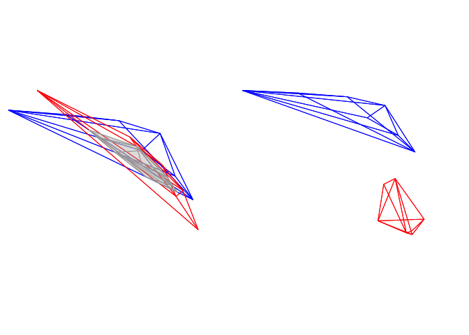

-   [Analysing Spectral Data](#analysing-spectral-data)
    -   [Spectral Dataset Description](#spectral-dataset-description)
    -   [Overview](#overview)
    -   [Spectral Shape Analysis](#spectral-shape-analysis)
        -   [Colourimetric Variables](#colourimetric-variables)
        -   [Peak Shape Descriptors](#peak-shape-descriptors)
    -   [Visual Modelling](#visual-modelling)
        -   [Overview](#overview-1)
        -   [Accessing and Plotting In-built Spectral
            Data](#accessing-and-plotting-in-built-spectral-data)
        -   [Visual Phenotypes](#visual-phenotypes)
        -   [Estimating Quantum Catch](#estimating-quantum-catch)
        -   [The Receptor Noise Model](#the-receptor-noise-model)
            -   [Noise-weighted Distances with `coldist()` and
                `bootcoldist()`](#noise-weighted-distances-with-coldist-and-bootcoldist)
            -   [Converting receptor noise-corrected distances to
                Cartesian
                coordinates](#converting-receptor-noise-corrected-distances-to-cartesian-coordinates)
        -   [Colourspaces](#colourspaces)
            -   [Di-, Tri-, and Tetrachromatic
                Colourspaces](#di--tri--and-tetrachromatic-colourspaces)
            -   [The Colour Hexagon](#the-colour-hexagon)
            -   [The Colour Opponent Coding (COC)
                Space](#the-colour-opponent-coding-coc-space)
            -   [CIE Spaces](#cie-spaces)
            -   [Categorical Fly
                Colourspace](#categorical-fly-colourspace)
            -   [Segment Classification](#segment-classification)
            -   [Colourspace Distances with
                `coldist`](#colourspace-distances-with-coldist)
            -   [Distances in N-Dimensions](#distances-in-n-dimensions)
-   [Analyzing Spatial Data](#analyzing-spatial-data)
    -   [Image-based colour
        classification](#image-based-colour-classification)
    -   [Adjacency and Boundary Strength Analyses, and Overall Pattern
        Contrasts](#adjacency-and-boundary-strength-analyses-and-overall-pattern-contrasts)
        -   [Example 1 (simple): mounted
            butterflies](#example-1-simple-mounted-butterflies)
        -   [Example 2 (complex): whole visual
            environments](#example-2-complex-whole-visual-environments)
-   [References](#references)

Let’s again begin by loading the package.

    # Load the package, and set a global random-number seed for the reproducible generation of fake data later on.
    library(pavo)
    set.seed(1612217)

Analysing Spectral Data
=======================

Spectral Dataset Description
----------------------------

The raw spectral data used in this example are available from the
package repository on [github](https://github.com/rmaia/pavo), located
[here](https://github.com/rmaia/pavo/blob/master/data_external/vignette).
You can download and extract it to follow the vignette exactly.
Alternatively, the data are included as an RData file as part of the
package installation, and so can be loaded directly (see below).

The data consist of reflectance spectra, obtained using Avantes
equipment and software, from seven bird species: Northern Cardinal
*Cardinalis cardinalis*, Wattled Jacana *Jacana jacana*, Baltimore
Oriole *Icterus galbula*, Peach-fronted Parakeet *Aratinga aurea*,
American Robin *Turdus migratorius*, and Sayaca Tanager *Thraupis
sayaca*. Several individuals were measured (sample size varies by
species), and 3 spectra were collected from each individual. However,
the number of individuals measured per species is uneven and the data
have additional peculiarities that should emphasize the flexibility
`pavo` offers, as we’ll see below.

In addition, `pavo` includes three datasets that can be called with the
`data` function. `data(teal)`, `data(sicalis)`, and `data(flowers)` will
all be used in this vignette. See the help files for each dataset for
more information; via `?teal`, `?sicalis`, and `?flowers`.

    specs <- readRDS(system.file("extdata/specsdata.rds", package = "pavo"))
    mspecs <- aggspec(specs, by = 3, FUN = mean)
    spp <- gsub('\\.[0-9].*$', '', names(mspecs))[-1]
    sppspec <- aggspec(mspecs, by = spp, FUN = mean)
    spec.sm <- procspec(sppspec, opt = "smooth", span = 0.2)

    ## processing options applied:
    ## smoothing spectra with a span of 0.2

Overview
--------

`pavo` offers two main approaches for spectral data analysis. First,
colour variables can be calculated based on the shape of the reflectance
spectra. By using special `R` classes for spectra data frame objects,
this can easily be done using the `summary` function with an `rspec`
object (see below). The function `peakshape()` also returns descriptors
for individual peaks in spectral curves, as outlined below.

Second, reflectance spectra can be analysed by accounting for the visual
system receiving the colour signal, therefore representing reflectance
spectra as perceived colours. To that end, we have implemented a suite
of visual models and colourspaces including; the receptor-noise limited
model of model of Vorobyev et al. (1998), Endler (1990)’s segment
classification method, flexible di- tri- and tetra-chromatic
colourspaces, the Hexagon model of Chittka (1992), the colour-opponent
coding space of Backhaus (1991), CIELAB and CIEXYZ spaces, and the
categorical model of Troje (1993).

Spectral Shape Analysis
-----------------------

### Colourimetric Variables

Obtaining colourimetric variables (pertaining to hue, saturation and
brightness/value) is pretty straightforward in `pavo`. Since reflectance
spectra is stored in an object of class `rspec`, the `summary` function
recognizes the object as such and extracts 23 variables, as outlined in
Montgomerie (2006). Though outlined in a book chapter on bird
colouration, these variables are broadly applicable to any reflectance
data, particularly if the taxon of interest has colour vision within the
UV-human visible range.

The description and formulas for these variables can be found by running
`?summary.rspec`.

    summary(spec.sm)

`summary` also takes an additional argument `subset` which if changed
from the default `FALSE` to `TRUE` will return only the most commonly
used colourimetrics (Andersson and Prager 2006). `summary` can also take
a vector of colour variable names, which can be used to filter the
results

    summary(spec.sm, subset = TRUE)

    # Extract only brightness variables
    summary(spec.sm, subset = c('B1', 'B2', 'B3'))

### Peak Shape Descriptors

Particularly in cases of reflectance spectra that have multiple discrete
peaks (in which case the `summary` function will only return variables
based on the tallest peak in the curve), it might be useful to obtain
variables that describe individual peak’s properties. The `peakshape()`
function identifies the peak location (`H1`), returns the reflectance at
that point (`B3`), and identifies the wavelengths at which the
reflectance is half that at the peak, calculating the wavelength
bandwidth of that interval (the Full Width at Half Maximum, or `FWHM`).
The function also returns the half widths, which are useful when the
peaks are located near the edge of the measurement limit and half
maximum reflectance can only be reliably estimated from one of its
sides.

If this all sounds too esoteric, fear not: `peakshape()` has the option
of returning plots indicating what it’s calculating. The vertical
continuous red line indicates the peak location, the horizontal
continuous red line indicates the half-maximum reflectance, and the
distance between the dashed lines (`HWHM.l` and `HWHM.r`) is the FWHM:

    par(mfrow = c(2, 3))
    peakshape(spec.sm, plot = TRUE)

    ##         id       B3  H1 FWHM HWHM.l HWHM.r incl.min
    ## 1 cardinal 52.70167 700   NA    114     NA      Yes
    ## 2   jacana 53.78744 700   NA    172     NA      Yes
    ## 3   oriole 54.15508 700   NA    149     NA      Yes
    ## 4 parakeet 29.86504 572  126     63     63      Yes
    ## 5    robin 37.85542 700   NA    107     NA      Yes
    ## 6  tanager 30.48108 557  166     81     85      Yes

As it can be seen, the variable FWHM is meaningless if the curve doesn’t
have a clear peak. Sometimes, such as in the case of the Cardinal (Above
figure, first panel), there might be a peak which is not the point of
maximum reflectance of the entire spectral curve. `peakshape()` also
offers a `select` argument to facilitate subsetting the spectra data
frame to, for example, focus on a single reflectance peak:

    peakshape(spec.sm, select = 2, lim = c(300, 500), plot = TRUE)

    ##         id       B3  H1 FWHM HWHM.l HWHM.r incl.min
    ## 1 cardinal 17.84381 369  100     46     54      Yes

Visual Modelling
----------------

### Overview

All visual and colourspace modelling and plotting options are wrapped
into four main function: `vismodel()`, `colspace()`, `coldist()` (or its
bootstrap-based variant `bootcoldist()`), and `plot`. As detailed below,
these functions cover the basic processes common to most modelling
approaches. Namely, the estimation of quantum catches, their conversion
to an appropriate space, estimating the distances between samples, and
visualising the results. As a brief example, a typical workflow for
modelling might use:

1.  `vismodel()` to estimate photoreceptor quantum catches. The
    assumptions of visual models may differ dramatically, so be sure to
    select options that are appropriate for your intended use.
2.  `colspace()` to convert the results of `vismodel()` (or
    user-provided quantum catches) into points in a given colourspace,
    specified with the `space` argument. If no `space` argument is
    provided, `colspace()` will automatically select the di-, tri- or
    tetrahedral colourspace, depending on the nature of the input data.
    The result of `colspace()` will be an object of class `colspace`
    (that inherits from `data.frame`), and will contain the location of
    stimuli in the selected space along with any associated colour
    variables.
3.  `coldist()` or `bootcoldist()` to estimate the colour distances
    between points in a colourspace (if the input is from `colspace`),
    or the ‘perceptual’, noise-weighted distances in the receptor-noise
    limited model (if the input is from `vismodel()` where
    `relative = FALSE`).
4.  `plot` the output. `plot` will automatically select the appropriate
    visualisation based on the input `colspace` object, and will also
    accept various graphical parameters depending on the colourspace
    (see `?plot.colspace` and links therein for details).

### Accessing and Plotting In-built Spectral Data

All in-built spectral data in `pavo` can be easily retrieved and/or
plotted via the `sensdata()` function. These data can be visualised
directly by including `plot = TRUE`, or assigned to an object for
subsequent use, as in:

    musca_sense <- sensdata(visual = "musca", achromatic = "md.r1")
    head(musca_sense)

    ##    wl    musca.u     musca.s     musca.m     musca.l       md.r1
    ## 1 300 0.01148992 0.006726680 0.001533875 0.001524705 0.001713692
    ## 2 301 0.01152860 0.006749516 0.001535080 0.001534918 0.001731120
    ## 3 302 0.01156790 0.006773283 0.001536451 0.001545578 0.001751792
    ## 4 303 0.01160839 0.006798036 0.001537982 0.001556695 0.001775960
    ## 5 304 0.01165060 0.006823827 0.001539667 0.001568283 0.001803871
    ## 6 305 0.01169510 0.006850712 0.001541499 0.001580352 0.001835777

### Visual Phenotypes

`pavo` contains numerous di-, tri- and tetrachromatic visual systems, to
accompany the suite of new models. The full complement of included
systems are accessible via the `vismodel()` argument `visual`, and
include:

<table>
<caption>Built-in visual phenotypes available in pavo</caption>
<thead>
<tr class="header">
<th style="text-align: left;">phenotype</th>
<th style="text-align: left;">description</th>
</tr>
</thead>
<tbody>
<tr class="odd">
<td style="text-align: left;">avg.uv</td>
<td style="text-align: left;">average ultraviolet-sensitive avian (tetrachromat)</td>
</tr>
<tr class="even">
<td style="text-align: left;">avg.v</td>
<td style="text-align: left;">average violet-sensitive avian (tetrachromat)</td>
</tr>
<tr class="odd">
<td style="text-align: left;">bluetit</td>
<td style="text-align: left;">The blue tit <em>Cyanistes caeruleus</em> (tetrachromat)</td>
</tr>
<tr class="even">
<td style="text-align: left;">star</td>
<td style="text-align: left;">The starling <em>Sturnus vulgaris</em> (tetrachromat)</td>
</tr>
<tr class="odd">
<td style="text-align: left;">pfowl</td>
<td style="text-align: left;">The peafowl <em>Pavo cristatus</em> (tetrachromat)</td>
</tr>
<tr class="even">
<td style="text-align: left;">apis</td>
<td style="text-align: left;">The honeybee <em>Apis mellifera</em> (trichromat)</td>
</tr>
<tr class="odd">
<td style="text-align: left;">ctenophorus</td>
<td style="text-align: left;">The ornate dragon lizard <em>Ctenophorus ornatus</em> (trichromat)</td>
</tr>
<tr class="even">
<td style="text-align: left;">canis</td>
<td style="text-align: left;">The canid <em>Canis familiaris</em> (dichromat)</td>
</tr>
<tr class="odd">
<td style="text-align: left;">musca</td>
<td style="text-align: left;">The housefly <em>Musca domestica</em> (tetrachromat)</td>
</tr>
<tr class="even">
<td style="text-align: left;">cie2</td>
<td style="text-align: left;">2-degree colour matching functions for CIE models of human colour vision (trichromat)</td>
</tr>
<tr class="odd">
<td style="text-align: left;">cie10</td>
<td style="text-align: left;">10-degree colour matching functions for CIE models of human colour vision (trichromat)</td>
</tr>
<tr class="even">
<td style="text-align: left;">segment</td>
<td style="text-align: left;">A generic ‘viewer’ with broad sensitivities for use in the segment analysis of Endler (1990) (tetrachromat)</td>
</tr>
<tr class="odd">
<td style="text-align: left;">habronattus</td>
<td style="text-align: left;">The jumping spider <em>Habronattus pyrrithrix</em> (trichromat)</td>
</tr>
<tr class="even">
<td style="text-align: left;">rhinecanthus</td>
<td style="text-align: left;">The triggerfish <em>Rhinecanthus aculeatus</em> (trichromat)</td>
</tr>
</tbody>
</table>

### Estimating Quantum Catch

Numerous models have been developed to understand how colours are
perceived and discriminated by an individual’s or species’ visual system
(described in detail in Endler 1990; Renoult, Kelber, and Schaefer 2017;
Vorobyev et al. 1998). In essence, these models take into account the
receptor sensitivity of the different receptors that make the visual
system in question and quantify how a given colour would stimulate those
receptors individually, and their combined effect on the perception of
colour. These models also have an important component of assuming and
interpreting the chromatic component of colour (hue and saturation) to
be processed independently of the achromatic (brightness, or luminance)
component. This provides a flexible framework allowing for a tiered
model construction, in which information on aspects such as different
illumination sources, backgrounds, and visual systems can be considered
and compared.

To apply any such model, we first need to quantify receptor excitation
and then consider how the signal is being processed, while possibly
considering the relative density of different cones and the
noise-to-signal ratio.

To quantify the stimulation of cones by the emitted colour, we will use
the `pavo` function `vismodel()`. This function takes an `rspec`
dataframe as a minimal input, and the user can either select from the
available options or input their own data for the additional arguments
in the function:

-   `visual`: the visual system to be used. Available inbuilt options
    are detailed above, or the user may include their own dataframe,
    with the first column being the wavelength range and the following
    columns being the absorbance at each wavelength for each cone type
    (see below for an example).
-   `achromatic`: Either a receptor’s sensitivity data (available
    options include the blue tit, chicken, and starling double-cones,
    and the housefly’s R1-6 receptor), which can also be user-defined as
    above; or the longest-wavelength receptor, the sum of the two
    longest-wavelength receptors, or the sum of all receptors can be
    used. Alternatively, `none` can be specified for no achromatic
    stimulation calculation.
-   `illum`: The illuminant being considered. By default, it considers
    an ideal white illuminant, but implemented options are a blue sky,
    standard daylight, and forest shade illuminants. A vector of same
    length as the wavelength range being considered can also be used as
    the input.
-   `trans`: Models of the effects of light transmission (e.g. through
    noisy environments or ocular filters). The argument defaults to
    `ideal` (i.e. no effect), though users can also use the built-in
    options of `bluetit` or `blackbird` to model the ocular transmission
    of blue tits/blackbirds, or specify a user-defined vector containing
    transmission spectra.
-   `qcatch`: This argument determines what photon catch data should be
    returned
    -   `Qi`: The receptor quantum catches, calculated for receptor *i*
        as:
        *Q**i* = ∫*λ**R**i*(*λ*)*S*(*λ*)*I*(*λ*)*d**λ*
        Where *λ* denotes the wavelength, *R**i*(*λ*) the
        spectral sensitivity of receptor *i*, *S*(*λ*) the reflectance
        spectrum of the colour, and *I*(*λ*) the illuminant spectrum.
    -   `fi`: The receptor quantum catches transformed according to
        Fechner’s law, in which the signal of the receptor is
        proportional to the logarithm of the quantum catch
        i.e. *f**i* = ln (*Q**i*)
    -   `Ei`: the hyperbolic transform (a simplification of the
        Michaelis–Menten photoreceptor equation), where
        $$E\_i = \\frac{Q\_i}{Q\_i + 1}$$
        .
-   `bkg`: The background being considered. By default, it considers an
    idealized background (i.e. wavelength-independent influence of the
    background on colour). A vector of same length as the wavelength
    range being considered can also be used as the input.
-   `vonkries`: a logical argument which determines if the von Kries
    transformation (which normalizes receptor quantum catches to the
    background, thus accounting for receptor adaptation) is to be
    applied (defaults to `FALSE`). If `TRUE`, *Q**i* is
    multiplied by a constant *k*, which describes the von Kries
    transformation:
    $$k\_i = \\frac{1}{\\int\_\\lambda R\_i(\\lambda)S^b(\\lambda)I(\\lambda)d\\lambda}$$
    Where *S**b* denotes the reflectance spectra of the
    background.
-   `scale`: This argument defines how the illuminant should be scaled.
    The scale of the illuminant is critical of receptor noise models in
    which the signal intensity influences the noise (see Receptor noise
    section, below). Illuminant curves should be in units of
    *μ**m**o**l*.*s* − 1.*m* − 2 in order to yield
    physiologically meaningful results. (Some software return illuminant
    information values in *μ**W**a**t**t*.*c**m* − 2, and
    must be converted to
    *μ**m**o**l*.*s* − 1.*m* − 2. This can be done
    by using the `irrad2flux()` and `flux2irrad()` functions.)
    Therefore, if the user-specified illuminant curves are *not* in
    these units (i.e. are measured proportional to a white standard, for
    example), the `scale` parameter can be used as a multiplier to yield
    curves that are at least a reasonable approximation of the
    illuminant value. Commonly used values are **500** for dim
    conditions and **10,000** for bright conditions.
-   `relative`: If `TRUE`, it will make the cone stimulations relative
    to their sum. This is appropriate for colourspace models such as the
    avian tetrahedral colourspace (Goldsmith 1990; Stoddard and
    Prum 2008). For the photon catch and neural noise model, it is
    important to set `relative = FALSE`.

All visual models begin with the estimation of receptor quantum catches.
The requirements of models may differ significantly of course, so be
sure to consult the function documentation and original publications.
For this example, we will use the average reflectance of the different
species to calculate the raw stimulation of retinal cones, considering
the avian average UV visual system, a standard daylight illumination,
and an idealized background.

    vismod1 <- vismodel(sppspec,
      visual = "avg.uv", achromatic = "bt.dc",
      illum = "D65", relative = FALSE
    )

Since there are multiple parameters that can be used to customize the
output of `vismodel()`, as detailed above, for convenience these can be
returned by using `summary` in a `vismodel` object:

    summary(vismod1)

    ## visual model options:
    ##  * Quantal catch: Qi 
    ##  * Visual system, chromatic: avg.uv 
    ##  * Visual system, achromatic: bt.dc 
    ##  * Illuminant: D65, scale = 1 (von Kries colour correction not applied) 
    ##  * Background: ideal 
    ##  * Transmission: ideal 
    ##  * Relative: FALSE

    ##        u                 s                 m                l         
    ##  Min.   :0.01093   Min.   :0.03749   Min.   :0.1297   Min.   :0.2171  
    ##  1st Qu.:0.01509   1st Qu.:0.06137   1st Qu.:0.1695   1st Qu.:0.2318  
    ##  Median :0.01925   Median :0.06353   Median :0.2595   Median :0.2866  
    ##  Mean   :0.02321   Mean   :0.08854   Mean   :0.2262   Mean   :0.3197  
    ##  3rd Qu.:0.03059   3rd Qu.:0.12753   3rd Qu.:0.2722   3rd Qu.:0.3969  
    ##  Max.   :0.04177   Max.   :0.15716   Max.   :0.2923   Max.   :0.4807  
    ##       lum        
    ##  Min.   :0.1501  
    ##  1st Qu.:0.1965  
    ##  Median :0.2194  
    ##  Mean   :0.2215  
    ##  3rd Qu.:0.2618  
    ##  Max.   :0.2755

We can visualise what `vismodel()` is doing when estimating quantum
catches by comparing the reflectance spectra to the estimates they are
generating:

    par(mfrow = c(2, 6), oma = c(3, 3, 0, 0))
    layout(rbind(c(2, 1, 4 , 3, 6 , 5),
                 c(1, 1, 3 , 3, 5 , 5), 
                 c(8, 7, 10, 9, 12, 11),
                 c(7, 7, 9 , 9, 11, 11)))

    sppspecol <- spec2rgb(sppspec)

    for (i in 1:6) {
      par(mar = c(2, 2, 2, 2))
      plot(sppspec, select = i+1, col = sppspecol, lwd = 3, ylim = c(0, 100))
      par(mar = c(4.1, 2.5, 2.5, 2))
      barplot(as.matrix(vismod1[i, 1:4]), yaxt = "n", col = "black")
    }

    mtext("Wavelength (nm)", side = 1, outer = TRUE, line = 1)
    mtext("Reflectance (%)", side = 2, outer = TRUE, line = 1)

As described above, `vismodel` also accepts user-defined visual systems,
background and illuminants. We will illustrate this by showcasing the
function `sensmodel`, which models spectral sensitivities of retinas
based on their peak cone sensitivity, as described in Govardovskii et
al. (2000) and Hart and Vorobyev (2005). `sensmodel` takes several
optional arguments, but the main one is a vector containing the peak
sensitivities for the cones being modelled. Let’s model an idealized
dichromat visual system, with cones peaking in sensitivity at 350 and
650 nm:

    idealizeddichromat <- sensmodel(c(350, 650))
    plot(idealizeddichromat, col = spec2rgb(idealizeddichromat), ylab = "Absorbance")

    vismod.idi <- vismodel(sppspec, visual = idealizeddichromat, relative = FALSE)
    vismod.idi

### The Receptor Noise Model

The receptor-noise limited (RNL) model of Vorobyev et al. (1998),
Vorobyev et al. (2001) offers a basis for estimating the ‘perceptual’
distance between coloured stimuli (depending on available physiological
and behavioural data), and assumes that the simultaneous discrimination
of colours is fundamentally limited by photoreceptor noise. Colour
distances under the RNL model can be calculated by using the inverse of
the noise-to-signal ratio, known as the Weber fraction
(*w**i* for each cone *i*). The Weber fraction can be
calculated from the noise-to-signal ratio of cone *i*
(*v**i*) and the relative number of receptor cells of type
*i* within the receptor field (*n**i*):

$$w\_i = \\frac{v\_i}{\\sqrt{n\_i}}$$

*w**i* is the value used for the noise when considering only
neural noise mechanisms. Alternatively, the model can consider that the
intensity of the colour signal itself contributes to the noise
(photoreceptor, or quantum, noise). In this case, the noise for a
receptor *i* is calculated as:

$$w\_i = \\sqrt{\\frac{v\_i^2}{\\sqrt{n\_i}} + \\frac{2}{Q\_a+Q\_b}}$$

where *a* and *b* refer to the two colour signals being compared. Note
that when the values of *Q**a* and *Q**b* are very
high, the second portion of the equation tends to zero, and the both
formulas should yield similar results. Hence, it is important that the
quantum catch are calculated in the appropriate illuminant scale, as
described above.

Colour distances are obtained by weighting the Euclidean distance of the
photoreceptor quantum catches by the Weber fraction of the cones
(*Δ**S*). These measurements are in units of Just Noticeable Differences
(JNDs), where distances over a certain threshold (usually 1) are
considered to be discernible under the conditions considered (e.g.,
backgrounds, illumination). The equations used in these calculations
are:

For dichromats:
$$\\Delta S = \\sqrt{\\frac{(\\Delta f\_1 - \\Delta f\_2)^2}{w\_1^2+w\_2^2}}$$

For trichromats:
$$\\Delta S = \\sqrt{\\frac{w\_1^2(\\Delta f\_3 - \\Delta f\_2)^2 + w\_2^2(\\Delta f\_3 - \\Delta f\_1)^2 +
w\_3^2(\\Delta f\_1 - \\Delta f\_2)^2 }{ (w\_1w\_2)^2 + (w\_1w\_3)^2 + (w\_2w\_3)^2 }}$$

For tetrachromats:
$$\\Delta S =
\\sqrt{(w\_1w\_2)^2(\\Delta f\_4 - \\Delta f\_3)^2 + (w\_1w\_3)^2(\\Delta f\_4 - \\Delta f\_2)^2 +
(w\_1w\_4)^2(\\Delta f\_3 - \\Delta f\_2)^2 + \\\\ (w\_2w\_3)^2(\\Delta f\_4 - \\Delta f\_1)^2 +
(w\_2w\_4)^2(\\Delta f\_3 - \\Delta f\_1)^2 + (w\_3w\_4)^2(\\Delta f\_2 - \\Delta f\_1)^2 / \\\\
((w\_1w\_2w\_3)^2 + (w\_1w\_2w\_4)^2 + (w\_1w\_3w\_4)^2 + (w\_2w\_3w\_4)^2)}$$

For the chromatic contrast. The achromatic contrast (*Δ**L*) can be
calculated based on the double cone or the receptor (or combination of
receptors) responsible for chromatic processing by the equation:

$$\\Delta L = \\frac{\\Delta f}{w}$$

#### Noise-weighted Distances with `coldist()` and `bootcoldist()`

`pavo` implements the noise-weighted colour distance calculations in the
functions `coldist()` and `bootcoldist()`, assuming that raw receptor
quantum catches are provided (via `relative = FALSE` in `vismodel()`).
For the achromatic contrast, `coldist()` uses `n4` to calculate *w* for
the achromatic contrast. Note that even if *Q**i* is chosen,
values are still log-transformed. This option is available in case the
user wants to specify a data frame of quantum catches that was not
generated by `vismodel()` as an input. In this case, the argument
`qcatch` should be used to inform the function if *Q**i* or
*f**i* values are being used (note that if the input to
`coldist()` is an object generated using the `vismodel()` function, this
argument is ignored.) The type of noise to be calculated can be selected
from the `coldist()` argument `noise` (which accepts either `"neural"`
or `"quantum"`).

    coldist(vismod1,
      noise = "neural", achromatic = TRUE, n = c(1, 2, 2, 4),
      weber = 0.1, weber.achro = 0.1
    )

    ##      patch1   patch2        dS        dL
    ## 1  cardinal   jacana  8.423965 3.3449627
    ## 2  cardinal   oriole  7.905876 3.5110820
    ## 3  cardinal parakeet  7.999730 0.5177495
    ## 4  cardinal    robin  5.805562 2.5606167
    ## 5  cardinal  tanager 10.100311 1.9068807
    ## 6    jacana   oriole 10.151253 0.1661193
    ## 7    jacana parakeet  4.231570 2.8272132
    ## 8    jacana    robin  3.503769 5.9055794
    ## 9    jacana  tanager  5.126266 1.4380820
    ## 10   oriole parakeet  8.135793 2.9933325
    ## 11   oriole    robin  7.220505 6.0716987
    ## 12   oriole  tanager 13.608253 1.6042013
    ## 13 parakeet    robin  4.606847 3.0783661
    ## 14 parakeet  tanager  5.969760 1.3891312
    ## 15    robin  tanager  7.688707 4.4674974

    coldist(vismod.idi, n = c(1, 2), weber = 0.1)

    ##      patch1   patch2        dS dL
    ## 1  cardinal   jacana 2.0993283 NA
    ## 2  cardinal   oriole 4.6567462 NA
    ## 3  cardinal parakeet 2.2575457 NA
    ## 4  cardinal    robin 3.7236780 NA
    ## 5  cardinal  tanager 3.5417700 NA
    ## 6    jacana   oriole 2.5574178 NA
    ## 7    jacana parakeet 4.3568740 NA
    ## 8    jacana    robin 1.6243496 NA
    ## 9    jacana  tanager 5.6410983 NA
    ## 10   oriole parakeet 6.9142918 NA
    ## 11   oriole    robin 0.9330682 NA
    ## 12   oriole  tanager 8.1985162 NA
    ## 13 parakeet    robin 5.9812236 NA
    ## 14 parakeet  tanager 1.2842244 NA
    ## 15    robin  tanager 7.2654480 NA

Where `dS` is the chromatic contrast (*Δ**S*) and `dL` is the achromatic
contrast (*Δ**L*). Note that, by default, `achromatic = FALSE`, so `dL`
isn’t included in the second result (this is to maintain consistency
since, in the `vismodel()` function, the `achromatic` argument defaults
to `none`). As expected, values are really high under the avian colour
vision, since the colours of these species are quite different and
because of the enhanced discriminatory ability with four compared to two
cones.

`coldist()` also has a `subset` argument, which is useful if only
certain comparisons are of interest (for example, of colour patches
against a background, or only comparisons among a species or body
patch). `subset` can be a vector of length one or two. If only one
subsetting option is passed, all comparisons against the matching
argument are returned (useful in the case of comparing to a background,
for example). If two values are passed, comparisons will only be made
between samples that match that rule (partial string matching and
regular expressions are accepted). For example, compare:

    coldist(vismod1, subset = 'cardinal')

    ##     patch1   patch2        dS dL
    ## 1 cardinal   jacana  8.423965 NA
    ## 2 cardinal   oriole  7.905876 NA
    ## 3 cardinal parakeet  7.999730 NA
    ## 4 cardinal    robin  5.805562 NA
    ## 5 cardinal  tanager 10.100311 NA

to:

    coldist(vismod1, subset = c('cardinal', 'jacana'))

    ##     patch1 patch2       dS dL
    ## 1 cardinal jacana 8.423965 NA

A bootstrap-based variant of `coldist()`, described in Maia and White
(2018) as part of a more general analytical framework, is implemented
via the function `bootcoldist()`. As the name suggests, `bootcoldist()`
uses a bootstrap procedure to generate confidence intervals for the mean
chromatic and/or achromatic distance between two or more samples of
colours. This has the benefit of generating useful errors around
distance estimates, which can be inspected for the inclusion of
appropriate ‘threshold’, when asking common kinds of questions that
relate to between-group differences (e.g. animals-vs-backgrounds, sexual
dichromatism, colour polymorphism). The function’s arguments are shared
`coldist()` save for a few extra requirements. The `by` argument is used
to specify a grouping variable that defines the groups to be compared,
while `boot.n` and `alpha` control the number of bootstrap replicates
and the confidence level for the confidence interval, respectively. The
latter two have sensible defaults, but the `by` argument is required.

Here we run present a quick example that tests for colour differences
across three body regions (breast, crown, and throat) of the finch
*Sicalis citrina*, given seven measures of each region from different
males.

    # Load the data
    data(sicalis)

    # Construct a model using an avian viewer
    sicmod <- vismodel(sicalis, visual = 'avg.uv', relative = FALSE)

    # Create a grouping variable to group by body region,
    # informed by the spectral data names
    regions <- substr(rownames(sicmod), 6, 6)

    # Estimate bootstrapped colour-distances
    sicdist <- bootcoldist(sicmod, by = regions, n = c(1, 2, 2, 4), weber = 0.05)

    # Take a look at the resulting pairwise estimates 
    sicdist

    ##       dS.mean    dS.lwr    dS.upr
    ## B-C  9.253097 5.7015179 14.013095
    ## B-T  3.483528 0.3728945  9.509223
    ## C-T 12.221038 8.1736179 16.899949

And plot the results for good measure. We can see that the pairwise
comparisons of the chest, breast, and throat are quite chromatically
distinct, but the breast and throat are much more similar in colour,
perhaps to the point of being indistinguishable.

    plot(sicdist[, 1], 
         ylim = c(0, 20), 
         pch = 21, 
         bg = 1, 
         cex = 2, 
         xaxt = 'n', 
         xlab = 'Centroid comparison', 
         ylab = 'Chromatic contrast (dS)')
    axis(1, at = 1:3, labels = rownames(sicdist))
    segments(1:3, sicdist[, 2], 1:3, sicdist[, 3], lwd = 2)  # Add CI's
    abline(h = 1, lty = 3, lwd = 2)  # Add a 'threshold' line at dS = 1

#### Converting receptor noise-corrected distances to Cartesian coordinates

You can convert distances in JND back to Cartesian position coordinates
with the function `jnd2xyz()`. Note that the actual position of these
points in the XYZ space is arbitrary; therefore the function allows you
to rotate the data so that, for example, the vector leading to the
long-wavelength cone aligns with the X axis:

    fakedata1 <- vapply(
      seq(100, 500, by = 20),
      function(x) rowSums(cbind(
          dnorm(300:700, x, 30),
          dnorm(300:700, x + 400, 30)
        )),
        numeric(401)
    )

    # Creating idealized specs with varying saturation
    fakedata2 <- vapply(
      c(500, 300, 150, 105, 75, 55, 40, 30),
      function(x) dnorm(300:700, 550, x),
      numeric(401)
    )

    fakedata1 <- as.rspec(data.frame(wl = 300:700, fakedata1))
    fakedata1 <- procspec(fakedata1, "max")
    fakedata2 <- as.rspec(data.frame(wl = 300:700, fakedata2))
    fakedata2 <- procspec(fakedata2, "sum")
    fakedata2 <- procspec(fakedata2, "min")

    # Converting reflectance to percentage
    fakedata1[, -1] <- fakedata1[, -1] * 100
    fakedata2[, -1] <- fakedata2[, -1] / max(fakedata2[, -1]) * 100

    # Combining and converting to rspec
    fakedata.c <- data.frame(wl = 300:700, fakedata1[, -1], fakedata2[, -1])
    fakedata.c <- as.rspec(fakedata.c)

    # Visual model and colour distances
    fakedata.vm <- vismodel(fakedata.c, relative = FALSE, achromatic = 'all')
    fakedata.cd <- coldist(fakedata.vm,
      noise = "neural", n = c(1, 2, 2, 4),
      weber = 0.1, achromatic = TRUE
    )

    # Converting to Cartesian coordinates
    fakedata.cc <- jnd2xyz(fakedata.cd, ref1 = "l", axis1 = c(1, 0, 0), ref2 = NULL)
    head(fakedata.cc)

    ##             x          y         z      lum
    ## X1 -26.165302   3.692783 -17.71718 1.430788
    ## X2 -11.212399  -2.085407 -27.97937 2.315951
    ## X3   3.076291  -7.441594 -37.76761 3.621349
    ## X4  16.523287 -12.475488 -46.33606 4.341465
    ## X5  25.812150 -17.848152 -40.71621 4.444027
    ## X6  31.912643 -23.368560 -24.79660 4.046863

which you can then plot as well:

    plot(fakedata.cc, theta = 55, phi = 25, col = spec2rgb(fakedata.c))

The axes in this colourspace are in JND units. For more information on
these functions, see `?jnd2xyz`, `?jndrot` and `?jndplot`.

### Colourspaces

Another general, flexible representation of stimuli is the colour space
model. In such approaches, photon catches are expressed in relative
values (so that the quantum catches of all receptors involved in
chromatic discrimination sum to 1). The maximum stimulation of each cone
*n* is placed at the vertex of a (*n* − 1)-dimensional polygon that
encompasses all theoretical colours that can be perceived by that visual
system. For the avian visual system comprised of 4 cones, for example,
all colours can be placed somewhere in the volume of a tetrahedron, in
which each of the four vertices represents the maximum stimulation of
that particular cone type.

Though these models do not account for receptor noise (and thus do not
allow an estimate of JNDs), they presents several advantages. First,
they make for a very intuitive representation of colour points
accounting for attributes of the colour vision of the signal receiver.
Second, they allow for the calculation of several interesting variables
that represent colour. For example, hue can be estimated from the angle
of the point relative to the xy plane (blue-green-red) and the z axis
(UV); saturation can be estimated as the distance of the point from the
achromatic centre.

`data(flowers)` is a new example dataset consisting of reflectance
spectra from 36 Australian angiosperm species, which we’ll use to
illustrate for the following colourspace modelling.

    data(flowers)

    head(flowers[1:4])

    ##    wl Goodenia_heterophylla Goodenia_geniculata Goodenia_gracilis
    ## 1 300             1.7426387            1.918962         0.3638354
    ## 2 301             1.5724849            1.872966         0.3501921
    ## 3 302             1.4099808            1.828019         0.3366520
    ## 4 303             1.2547709            1.784152         0.3231911
    ## 5 304             1.1064997            1.741398         0.3097854
    ## 6 305             0.9648117            1.699792         0.2964107

#### Di-, Tri-, and Tetrachromatic Colourspaces

`pavo` has extensive modelling and visualisation capabilities for
generic di-, tri-, and tetra-chromatic spaces, uniting these approaches
in a cohesive workflow. As with most colourspace models, we first
estimate relative quantum catches with various assumptions by using the
`vismodel()` function, before converting each set of values to a
location in colourspace by using the `space` argument in `colspace()`
(the function can also be set to try to detect the dimensionality of the
colourspace automatically). For di- tri- and tetrachromatic spaces,
`colspace()` calculates the coordinates of stimuli as:

**Dichromats:**
$$x = \\frac{1}{\\sqrt{2}}(Q\_l - Q\_s)$$

**Trichromats:**
$$x = \\frac{1}{\\sqrt{2}}(Q\_l - Q\_m)$$
$$y = \\frac{\\sqrt{2}}{\\sqrt{3}}(Q\_s - \\frac{Q\_l + Q\_m}{2})$$

**Tetrachromats:**
$$x = \\frac{1}{\\sqrt{2}}(Q\_l - Q\_m)$$
$$y = \\frac{\\sqrt{2}}{\\sqrt{3}}(Q\_s - \\frac{Q\_l + Q\_m}{2})$$
$$z = \\frac{\\sqrt{3}}{2}(Q\_u - \\frac{Q\_l + Q\_m + Q\_s}{3})$$

Where Qu, Qs, Qm, and Ql
refer to quantum catch estimates for UV-, short, medium-, and
long-wavelength photoreceptors, respectively.

For a dichromatic example, we can model our floral reflectance data
using the visual system of the domestic dog *Canis familiaris*, which
has two cones with maximal sensitivity near 440 and 560 nm.

    vis.flowers <- vismodel(flowers, visual = 'canis')

    di.flowers <- colspace(vis.flowers, space = 'di')

    head(di.flowers)

    ##                                s         l           x      r.vec lum
    ## Goodenia_heterophylla 0.52954393 0.4704561 -0.04178143 0.04178143  NA
    ## Goodenia_geniculata   0.25430150 0.7456985  0.34747015 0.34747015  NA
    ## Goodenia_gracilis     0.01747832 0.9825217  0.68238870 0.68238870  NA
    ## Xyris_operculata      0.39433933 0.6056607  0.14942675 0.14942675  NA
    ## Eucalyptus_sp         0.40628552 0.5937145  0.13253229 0.13253229  NA
    ## Faradaya_splendida    0.23166580 0.7683342  0.37948187 0.37948187  NA

The output contains values for the relative stimulation of short- and
long-wavelength sensitive photoreceptors associated with each flower,
along with its single coordinate in dichromatic space and its r.vector
(distance from the origin). To visualise where these points lie, we can
simply plot them on a segment.

    plot(di.flowers, col = spec2rgb(flowers))

For our trichromatic viewer we can use the honeybee *Apis mellifera*,
one of the most significant and widespread pollinators. We’ll also
transform our quantum catches according to Fechner’s law by specifying
`qcatch = 'fi'`, and will model photoreceptor stimulation under bright
conditions by scaling our illuminant with the `scale` argument.

    vis.flowers <- vismodel(flowers, visual = 'apis', qcatch = 'fi', scale = 10000)

    tri.flowers <- colspace(vis.flowers, space = 'tri')

    head(tri.flowers)

    ##                               s         m         l            x           y
    ## Goodenia_heterophylla 0.2882383 0.3587254 0.3530363 -0.004022828 -0.05522995
    ## Goodenia_geniculata   0.2475326 0.3549832 0.3974842  0.030052720 -0.10508396
    ## Goodenia_gracilis     0.1373117 0.3125304 0.5501579  0.168028001 -0.24007647
    ## Xyris_operculata      0.2395035 0.3729820 0.3875145  0.010275990 -0.11491764
    ## Eucalyptus_sp         0.2760091 0.3548096 0.3691813  0.010162377 -0.07020755
    ## Faradaya_splendida    0.2654951 0.3431266 0.3913783  0.034119147 -0.08308452
    ##                          h.theta      r.vec lum
    ## Goodenia_heterophylla -1.6435057 0.05537626  NA
    ## Goodenia_geniculata   -1.2922439 0.10929687  NA
    ## Goodenia_gracilis     -0.9601417 0.29303604  NA
    ## Xyris_operculata      -1.4816131 0.11537616  NA
    ## Eucalyptus_sp         -1.4270471 0.07093922  NA
    ## Faradaya_splendida    -1.1811377 0.08981733  NA

As in the case of our dichromat, the output contains relative
photoreceptor stimulations, coordinates in the Maxwell triangle, as well
as the ‘hue angle’ `h.theta` and distance from the origin (`r.vec`).

    plot(tri.flowers, pch = 21, bg = spec2rgb(flowers))

Finally, we’ll draw on the blue tit’s visual system to model our floral
reflectance spectra in a tetrahedral space, again using log-transformed
quantum catches and assuming bright viewing conditions.

    vis.flowers <- vismodel(flowers, visual = "bluetit", qcatch = "fi", scale = 10000)

    tetra.flowers <- colspace(vis.flowers, space = "tcs")

    head(tetra.flowers)

    ##                               u         s         m         l         u.r
    ## Goodenia_heterophylla 0.2274310 0.2659669 0.2524170 0.2541851 -0.02256897
    ## Goodenia_geniculata   0.1625182 0.2721621 0.2828016 0.2825182 -0.08748184
    ## Goodenia_gracilis     0.0428552 0.2443091 0.3504414 0.3623943 -0.20714480
    ## Xyris_operculata      0.1766234 0.2709785 0.2642637 0.2881344 -0.07337659
    ## Eucalyptus_sp         0.2118481 0.2609468 0.2637023 0.2635028 -0.03815190
    ## Faradaya_splendida    0.1844183 0.2557660 0.2786393 0.2811764 -0.06558169
    ##                                s.r         m.r         l.r            x
    ## Goodenia_heterophylla  0.015966893 0.002417012 0.004185066 -0.007214866
    ## Goodenia_geniculata    0.022162064 0.032801599 0.032518179  0.006341799
    ## Goodenia_gracilis     -0.005690920 0.100441373 0.112394348  0.072312163
    ## Xyris_operculata       0.020978454 0.014263689 0.038134446  0.010505857
    ## Eucalyptus_sp          0.010946788 0.013702317 0.013502794  0.001565228
    ## Faradaya_splendida     0.005765955 0.028639328 0.031176408  0.015560661
    ##                                  y           z    h.theta     h.phi      r.vec
    ## Goodenia_heterophylla -0.005415708 -0.02256897 -2.4976873 -1.190529 0.02430520
    ## Goodenia_geniculata    0.003861848 -0.08748184  0.5469755 -1.486123 0.08779638
    ## Goodenia_gracilis      0.033297418 -0.20714480  0.4315247 -1.203879 0.22191605
    ## Xyris_operculata      -0.010813615 -0.07337659 -0.7998327 -1.368146 0.07490949
    ## Eucalyptus_sp          0.001044768 -0.03815190  0.5885699 -1.521510 0.03819828
    ## Faradaya_splendida     0.007189965 -0.06558169  0.4328380 -1.315140 0.06778487
    ##                           r.max r.achieved lum
    ## Goodenia_heterophylla 0.2692325 0.09027589  NA
    ## Goodenia_geniculata   0.2508989 0.34992737  NA
    ## Goodenia_gracilis     0.2678272 0.82857920  NA
    ## Xyris_operculata      0.2552227 0.29350636  NA
    ## Eucalyptus_sp         0.2503039 0.15260760  NA
    ## Faradaya_splendida    0.2583986 0.26232676  NA

Tetrahedral data (via `colspace(space = 'tcs')`) may be plotted in a
standard *static* tetrahedron by using `plot()`, or can be visualised as
part of an *interactive* tetrahedron by using `tcsplot()` with the
accessory functions `tcspoints()` and `tcsvol()` for adding points and
convex hulls, respectively. As with other colourspace plots there are a
number of associated graphical options, though the `theta` and `phi`
arguments are particularly useful in this case, as they control the
orientation (in degrees) of the tetrahedron in the xy and yz planes,
respectively.

When plotting the tetrahedral colourspace, one can also force
perspective by changing the size of points relative to their distance
from the plane of observation, using the arguments `perspective = TRUE`
and controlling the size range with the `range` argument. Several other
options control the appearance of this plot, you can check these using
`?plot.colspace` or `?tetraplot`

    plot(tetra.flowers, pch = 21, bg = spec2rgb(flowers), perspective = TRUE, range = c(1, 2), cex = 0.5)

Two additional functions may help with tetrahedral colourspace plotting:

-   `axistetra()` function can be used to draw arrows showing the
    direction and magnitude of distortion of x, y and z in the
    tetrahedral plot.
-   `legendtetra()` allows you to add a legend to a plot.

<!-- -->

    par(mfrow = c(1, 2), pty = "s")
    plot(tetra.flowers, pch = 21, bg = spec2rgb(flowers))
    axistetra(x = 0, y = 1.8)
    plot(tetra.flowers, theta = 110, phi = 10, pch = 21, bg = spec2rgb(flowers))
    axistetra(x = 0, y = 1.8)

For tetrahedral models, another plotting option available is `projplot`,
which projects colour points in the surface of a sphere encompassing the
tetrahedron. This plot is particularly useful to see differences in hue.

    projplot(tetra.flowers, pch = 20, col = spec2rgb(flowers))

    ## Warning in seq.default(lim[1], lim[2], len = 100): partial argument match of
    ## 'len' to 'length.out'

    ## Warning in seq.default(lim[3], lim[4], len = 100): partial argument match of
    ## 'len' to 'length.out'

Finally, a useful function for tri- and tetrahedral models is
`voloverlap()`, which calculates the overlap in tri- or tetrahedral
colour volume between two sets of points. This can be useful to explore
whether different species occupy similar (overlapping) or different
(non- overlapping) “sensory niches”, or to test for mimetism,
dichromatism, etc. (Stoddard and Stevens 2011). To show this function,
we will use the `sicalis` dataset, which includes measurements from the
crown (C), throat (T) and breast (B) of seven stripe-tailed yellow
finches (*Sicalis citrina*).

    data(sicalis)

We will use this dataset to test for the overlap between the volume
determined by the measurements of those body parts from multiple
individuals in the tetrahedral colourspace (note the option `plot` for
plotting of the volumes):

    par(mfrow = c(1, 2), pty = "s")
    tcs.sicalis.C <- subset(colspace(vismodel(sicalis)), "C")
    tcs.sicalis.T <- subset(colspace(vismodel(sicalis)), "T")
    tcs.sicalis.B <- subset(colspace(vismodel(sicalis)), "B")
    voloverlap(tcs.sicalis.T, tcs.sicalis.B, plot = TRUE)

    ##           vol1         vol2   overlapvol vsmallest      vboth
    ## 1 5.183721e-06 6.281511e-06 6.904074e-07 0.1331876 0.06407598

    voloverlap(tcs.sicalis.T, tcs.sicalis.C, plot = TRUE)

    ##           vol1         vol2 overlapvol vsmallest vboth
    ## 1 5.183721e-06 4.739152e-06          0         0     0

The function `voloverlap()` gives the volume (*V*) of the convex hull
delimited by the overlap between the two original volumes, and two
proportions are calculated from that:
vsmallest = *V**o**v**e**r**l**a**p*/min (*V**A*, *V**B*)
and
vboth = *V**o**v**e**r**l**a**p*/(*V**A* + *V**B*)
. Thus, if one of the volumes is entirely contained in the other,
`vsmallest` will equal 1.

So we can clearly see that there is overlap between the throat and
breast colours (of about 6%), but not between the throat and the crown
colours (Figures above).

**Summary variables for groups of points**

Another advantage of colourspace models is that they allow for the
calculation of useful summary statistics of groups of points, such as
the centroid of the points, the total volume occupied, the mean and
variance of hue span and the mean saturation. In `pavo`, the result of a
`colspace()` call is an object of class `colspace`, and thus these
summary statistics can be calculated simply by calling `summary`. Note
that the `summary` call can also take a `by` vector of group identities,
so that the variables are calculated for each group separately:

    summary(tetra.flowers)

    ## Colorspace & visual model options:
    ##  * Colorspace: tcs 
    ##  * Quantal catch: fi 
    ##  * Visual system, chromatic: bluetit 
    ##  * Visual system, achromatic: none 
    ##  * Illuminant: ideal, scale = 10000 (von Kries colour correction not applied) 
    ##  * Background: ideal 
    ##  * Relative: TRUE 
    ##  * Max possible chromatic volume: NA

    ##            centroid.u centroid.s centroid.m centroid.l        c.vol   rel.c.vol
    ## all.points  0.1948478  0.2554421  0.2704411   0.279269 0.0002510915 0.001159742
    ##             colspan.m   colspan.v huedisp.m huedisp.v   mean.ra    max.ra
    ## all.points 0.05706825 0.001682224 0.6413439 0.3157949 0.2428508 0.8285792

#### The Colour Hexagon

The hexagon colour space of Chittka (1992) is a generalised
colour-opponent model of hymenopteran vision that has found extremely
broad use, particularly in studies of bee-flower interactions. It’s also
often broadly applied across hymenopteran species, because the
photopigments underlying trichromatic vision in Hymenoptera appear to be
quite conserved (Briscoe and Chittka 2001). What’s particularly useful
is that colour distances within the hexagon have been extensively
validated against behaviour, and thus offer a relatively reliable
measure of perceptual distance.

In the hexagon, photoreceptor quantum catches are typically
hyperbolically transformed (and `pavo` will return a warning if the
transform is not selected), and vonkries correction is often used used
to model photoreceptor adaptation to a vegetation background. This can
all now be specified in `vismodel()`. including the optional use of a
‘green’ vegetation background. Note that although this is a colourspace
model, we specific `relative = FALSE` to return unnormalised quantum
catches, as required for the model.

    vis.flowers <- vismodel(flowers, visual = 'apis', qcatch = 'Ei', relative = FALSE, vonkries = TRUE, achromatic = 'l', bkg = 'green')

We can then apply the hexagon model in `colspace`, which will convert
our photoreceptor ‘excitation values’ to coordinates in the hexagon
according to:

$$x = \\frac{\\sqrt{3}}{2(E\_g + E\_{uv})}$$

*y* = *E**b* − 0.5(*E**u**v* + *E**g*)

    hex.flowers <- colspace(vis.flowers, space = 'hexagon')

    head(hex.flowers)

    ##                                s         m         l         x          y
    ## Goodenia_heterophylla 0.56572097 0.8237141 0.7053057 0.1208839  0.1882007
    ## Goodenia_geniculata   0.35761236 0.8176153 0.8670134 0.4411542  0.2053024
    ## Goodenia_gracilis     0.01888788 0.1622766 0.7810589 0.6600594 -0.2376968
    ## Xyris_operculata      0.21080752 0.7345122 0.6796464 0.4060263  0.2892853
    ## Eucalyptus_sp         0.55622758 0.8515289 0.8208038 0.2291297  0.1630132
    ## Faradaya_splendida    0.45855056 0.7828905 0.8565895 0.3447118  0.1253205
    ##                         h.theta     r.vec sec.fine sec.coarse       lum
    ## Goodenia_heterophylla  32.71320 0.2236793       30  bluegreen 0.1680153
    ## Goodenia_geniculata    65.04388 0.4865862       60  bluegreen 0.3548825
    ## Goodenia_gracilis     109.80467 0.7015541      100      green 0.2313678
    ## Xyris_operculata       54.53092 0.4985412       50  bluegreen 0.1518319
    ## Eucalyptus_sp          54.57024 0.2812005       50  bluegreen 0.2787543
    ## Faradaya_splendida     70.02119 0.3667853       70  bluegreen 0.3351008

Again, the output includes the photoreceptor excitation values for
short- medium- and long-wave sensitive photoreceptors, x and y
coordinates, and measures of hue and saturation for each stimulus. The
hexagon model also outputs two additional measures of of subjective
‘bee-hue’; `sec.fine` and `sec.coarse`. `sec.fine` describes the
location of stimuli within one of 36 ‘hue sectors’ that are specified by
radially dissecting the hexagon in 10-degree increments. `sec.coarse`
follows a similar principle, though here the hexagon is divided into
only five ‘bee-hue’ sectors: UV, UV-blue, blue, blue-green, green, and
UV-green. These can easily be visualised by specifying
`sectors = 'coarse` or `sectors = 'fine'` in a call to `plot` after
modelling.

    plot(hex.flowers, sectors = 'coarse', pch = 21, bg = spec2rgb(flowers))

#### The Colour Opponent Coding (COC) Space

The colour opponent coding (coc) space is an earlier hymenopteran visual
model (Backhaus 1991) which, although now seldom used in favour of the
hexagon, may prove useful for comparative work. While the initial
estimation of photoreceptor excitation is similar to that in the
hexagon, the coc subsequently specifies `A` and `B` coordinates based on
empirically-derived weights for the output from each photoreceptor:

*A* =  − 9.86*E**u* + 7.70*E**b* + 2.16*E**g*
*B* =  − 5.17*E**u* + 20.25*E**b* − 15.08*E**g*

Where *E**i* is the excitation value (hyperbolic-transformed
quantum catch) in photoreceptor *i*.

    vis.flowers <- vismodel(flowers, visual = "apis", qcatch = "Ei", relative = FALSE, vonkries = TRUE, bkg = "green")

    coc.flowers <- colspace(vis.flowers, space = "coc")

    head(coc.flowers)

    ##                                s         m         l        x          y
    ## Goodenia_heterophylla 0.56572097 0.8237141 0.7053057 2.288050  3.1194224
    ## Goodenia_geniculata   0.35761236 0.8176153 0.8670134 4.642329  1.6332926
    ## Goodenia_gracilis     0.01888788 0.1622766 0.7810589 2.750382 -8.5899171
    ## Xyris_operculata      0.21080752 0.7345122 0.6796464 5.045218  3.5349309
    ## Eucalyptus_sp         0.55622758 0.8515289 0.8208038 2.845304  1.9900420
    ## Faradaya_splendida    0.45855056 0.7828905 0.8565895 3.357182  0.5654568
    ##                           r.vec lum
    ## Goodenia_heterophylla  5.407473  NA
    ## Goodenia_geniculata    6.275622  NA
    ## Goodenia_gracilis     11.340299  NA
    ## Xyris_operculata       8.580149  NA
    ## Eucalyptus_sp          4.835346  NA
    ## Faradaya_splendida     3.922638  NA

The A and B coordinates are designated x and y in the output of coc for
consistency, and while the model includes a measure of saturation in
`r.vec`, it contains no associated measure of hue.

    plot(coc.flowers, pch = 21, bg = spec2rgb(flowers), yaxt = "n")

#### CIE Spaces

The CIE (International Commission on Illumination) colourspaces are a
suite of models of human colour vision and perception. `pavo 1.0` now
includes two of the most commonly used: the foundational 1931 CIE XYZ
space, and the more modern, perceptually calibrated CIE LAB space and
its cylindrical CIE LCh transformation. Tristimulus values in XYZ space
are calculated as:

*X* = *k*∫300700*R*(*λ*)*I*(*λ*)*x̄*(*λ*) *d**λ*
*Y* = *k*∫300700*R*(*λ*)*I*(*λ*)*ȳ*(*λ*) *d**λ*
*Z* = *k*∫300700*R*(*λ*)*I*(*λ*)*z̄*(*λ*) *d**λ*

where *x*, *y*, and *z* are the trichromatic colour matching functions
for a ‘standard colourimetric viewer’. These functions are designed to
describe an average human’s chromatic response within a specified
viewing arc in the fovea (to account for the uneven distribution of
cones across eye). `pavo` includes both the CIE 2-degree and the modern
10-degree standard observer, which can be selected in the `visual`
option in the `vismodel` function. In these equations, k is the
normalising factor

$$k = \\frac{100}{\\int\_{300}^{700}{I(\\lambda)\\bar{y}(\\lambda)\\,d\\lambda}}$$

and the chromaticity coordinates of stimuli are calculated as

$$x = \\frac{X}{X + Y + Z}$$
$$y = \\frac{Y}{X + Y + Z}$$
$$z = \\frac{Z}{X + Y + Z} = 1 - x - y$$

For modelling in both XYZ and LAB spaces, here we’ll use the CIE
10-degree standard observer, and assume a `D65` ‘standard daylight’
illuminant. Again, although they are colourspace models, we need to set
`relative = FALSE` to return raw quantum catch estimates,
`vonkries = TRUE` to account for the required normalising factor (as
above), and `achromatic = 'none'` since there is no applicable way to
estimate luminance in the CIE models. As with all models that have
particular requirements, `vismodel()` will output warnings and/or errors
if unusual or non-standard arguments are specified.

    vis.flowers <- vismodel(flowers, visual = 'cie10', illum = 'D65', vonkries = TRUE, relative = FALSE, achromatic = 'none')

    ciexyz.flowers <- colspace(vis.flowers, space = 'ciexyz')
    head(ciexyz.flowers)

    ##                               X         Y         Z         x         y
    ## Goodenia_heterophylla 0.2074305 0.2067084 0.3013614 0.2899097 0.2889005
    ## Goodenia_geniculata   0.6472803 0.6752456 0.4240380 0.3706021 0.3866137
    ## Goodenia_gracilis     0.5153064 0.4587957 0.0153714 0.5207885 0.4636766
    ## Xyris_operculata      0.2884446 0.2353124 0.2224271 0.3865595 0.3153544
    ## Eucalyptus_sp         0.4431842 0.4470468 0.4019893 0.3429634 0.3459524
    ## Faradaya_splendida    0.6636975 0.6553481 0.2869075 0.4132733 0.4080743
    ##                                z
    ## Goodenia_heterophylla 0.42118974
    ## Goodenia_geniculata   0.24278414
    ## Goodenia_gracilis     0.01553492
    ## Xyris_operculata      0.29808613
    ## Eucalyptus_sp         0.31108420
    ## Faradaya_splendida    0.17865248

The output is simply the tristimulus values and chromaticity coordinates
of stimuli, and we can visualise our results (along with a line
connecting monochromatic loci, by default) by calling

    plot(ciexyz.flowers, pch = 21, bg = spec2rgb(flowers))

The `Lab` space is a more recent development, and is a colour-opponent
model that attempts to mimic the nonlinear responses of the human eye.
The `Lab` space is also calibrated (unlike the `XYZ` space) such that
Euclidean distances between points represent relative perceptual
distances. This means that two stimuli that are farther apart in `Lab`
space should be *perceived* as more different than two closer points. As
the name suggests, the dimensions of the `Lab` space are *L*ightness
(i.e. subjective brightness), along with two colour-opponent dimensions
designated *a* and *b*. The `colspace()` function, when
`space = cielab`, simply converts points from the `XYZ` model according
to:

$$
L=\\begin{cases}
116\\left(\\frac{Y}{Y\_n}\\right)^\\frac{1}{3} & \\text{if } \\frac{Y}{Y\_n} &gt; 0.008856 \\\\
903.3\\left(\\frac{Y}{Y\_n}\\right) & \\text{if } \\frac{Y}{Y\_n} \\leq 0.008856
\\end{cases}
$$

$$a = 500\\left(f\\left(\\frac{X}{X\_n}\\right) - f\\left(\\frac{Y}{Y\_n}\\right)\\right)$$

$$b = 500\\left(f\\left(\\frac{Y}{Y\_n}\\right) - f\\left(\\frac{Z}{Z\_n}\\right)\\right)$$

where

$$
f(x)=\\begin{cases}
x^\\frac{1}{3} & \\text{if } x &gt; 0.008856 \\\\
7.787x + \\frac{4}{29} & \\text{if } x \\leq 0.008856
\\end{cases}
$$

Here, *X**n*, *Y**n*, *Z**n* are
neutral point values to model visual adaptation, calculated as:

*X**n* = ∫300700*R**n*(*λ*)*I*(*λ*)*x̄*(*λ*) *d**λ*
*Y**n* = ∫300700*R**n*(*λ*)*I*(*λ*)*ȳ*(*λ*) *d**λ*
*Z**n* = ∫300700*R**n*(*λ*)*I*(*λ*)*z̄*(*λ*) *d**λ*

when *R**n*(*λ*) is a perfect diffuse reflector (i.e. 1).

    cielab.flowers <- colspace(vis.flowers, space = 'cielab')
    head(cielab.flowers)

    ##                               X         Y         Z        L           a
    ## Goodenia_heterophylla 0.2074305 0.2067084 0.3013614 16.91253  0.91908831
    ## Goodenia_geniculata   0.6472803 0.6752456 0.4240380 55.24744 -7.78898966
    ## Goodenia_gracilis     0.5153064 0.4587957 0.0153714 37.53788 21.57990123
    ## Xyris_operculata      0.2884446 0.2353124 0.2224271 19.25286 19.66170677
    ## Eucalyptus_sp         0.4431842 0.4470468 0.4019893 36.57660  0.05744138
    ## Faradaya_splendida    0.6636975 0.6553481 0.2869075 53.61946  5.07048199
    ##                                b
    ## Goodenia_heterophylla -24.336189
    ## Goodenia_geniculata    19.981497
    ## Goodenia_gracilis      61.991586
    ## Xyris_operculata       -6.289287
    ## Eucalyptus_sp          -8.295538
    ## Faradaya_splendida     41.517115

Our output now contains the tristimulus `XYZ` values, as well as their
`Lab` counterparts, which are coordinates in the `Lab` space. These can
also be visualised in three-dimensional `Lab` space by calling `plot`:

    plot(cielab.flowers, pch = 21, bg = spec2rgb(flowers))

#### Categorical Fly Colourspace

The categorical colour vision model of Troje (1993) is a model of
dipteran vision, based on behavioural data from the blowfly *Lucilia*
sp. It assumes the involvement of all four dipteran photoreceptor
classes (R7 & R8 ‘pale’ and ‘yellow’ subtypes), and further posits that
colour vision is based on two specific opponent mechanisms (R7p - R8p,
and R7y - R8y). The model assumes that all colours are perceptually
grouped into one of four colour categories, and that flies are unable to
distinguish between colours that fall within the same category.

We’ll use the visual systems of the muscoid fly *Musca domestica*, and
will begin by estimating linear (i.e. untransformed) quantum catches for
each of the four photoreceptors.

    vis.flowers <- vismodel(flowers, qcatch = 'Qi', visual = 'musca', achromatic = 'none', relative = TRUE)

Our call to `colspace()` will then simply estimate the location of
stimuli in the categorical space as the difference in relative
stimulation between ‘pale’ (R7p - R8p) and ‘yellow’ (R7y - R8y)
photoreceptor pairs:

*x* = *R*7*p* − *R*8*p*

*y* = *R*7*y* − *R*8*y*

    cat.flowers <- colspace(vis.flowers, space = 'categorical')

    head(cat.flowers)

    ##                              R7p        R7y       R8p       R8y          x
    ## Goodenia_heterophylla 0.05387616 0.18710662 0.4335986 0.3254187 -0.3797224
    ## Goodenia_geniculata   0.02080098 0.08276030 0.3737592 0.5226795 -0.3529583
    ## Goodenia_gracilis     0.01153130 0.02501417 0.1420049 0.8214496 -0.1304736
    ## Xyris_operculata      0.01270353 0.12523419 0.4488377 0.4132246 -0.4361342
    ## Eucalyptus_sp         0.03461949 0.14207848 0.3977208 0.4255812 -0.3631013
    ## Faradaya_splendida    0.03599953 0.09188560 0.3129195 0.5591953 -0.2769200
    ##                                y category     r.vec   h.theta lum
    ## Goodenia_heterophylla -0.1383120     p-y- 0.4041279 -2.792284  NA
    ## Goodenia_geniculata   -0.4399192     p-y- 0.5640110 -2.246954  NA
    ## Goodenia_gracilis     -0.7964355     p-y- 0.8070519 -1.733176  NA
    ## Xyris_operculata      -0.2879904     p-y- 0.5226390 -2.557993  NA
    ## Eucalyptus_sp         -0.2835027     p-y- 0.4606695 -2.478681  NA
    ## Faradaya_splendida    -0.4673097     p-y- 0.5431971 -2.105745  NA

And it is simply the signs of these differences that define the four
possible fly-colour categories (p+y+, p-y+, p+y-, p-y-), which we can
see in the associated plot.

    plot(cat.flowers, pch = 21, bg = spec2rgb(flowers))

#### Segment Classification

The segment classification analysis (Endler 1990) does not assume any
particular visual system, but instead tries to classify colours in a
manner that captures common properties of many vertebrate (and some
invertebrate) visual systems. In essence, it breaks down the reflectance
spectrum region of interest into four equally-spaced regions, measuring
the relative signal along those regions. This approximates a
tetrachromatic system with ultraviolet, short, medium, and
long-wavelength sensitive photoreceptors.

Though somewhat simplistic, this model captures many of the properties
of other, more complex visual models, but without many of the additional
assumptions these make. It also provides results in a fairly intuitive
colour space, in which the angle corresponds to hue and the distance
from the centre corresponds to chroma (Figure below; in fact, variables
`S5` and `H4` from `summary.rspec()` are calculated from these relative
segments). Note that, while a segment analysis ranging from 300 or 400
nm to 700 nm corresponds quite closely to the human visual system colour
wheel, any wavelength range can be analysed in this way, returning a
360° hue space delimited by the range used.

The segment differences or “opponents” are calculated as:

$$LM = \\frac{ R\_\\lambda \\sum\_{\\lambda={Q4}} R\_\\lambda - \\sum\_{\\lambda={Q2}} R\_\\lambda }{\\sum\_{\\lambda={min}}^{max}R\_\\lambda}$$
$$MS = \\frac{ R\_\\lambda \\sum\_{\\lambda={Q3}} R\_\\lambda - \\sum\_{\\lambda={Q1}} R\_\\lambda }{\\sum\_{\\lambda={min}}^{max}R\_\\lambda}$$

Where *Q**i* represent the interquantile distances
(e.g. *Q*1 = *u**l**t**r**a**v**i**o**l**e**t*, *Q*2 = *b**l**u**e*,
*Q*3 = *g**r**e**e**n* and *Q*4 = *r**e**d*)

The segment classification model is obtained through the `colspace()`
argument `space = 'segment'`, following initial modelling with
`vismodel()`. The example below uses idealized reflectance spectra to
illustrate how the avian colour space defined from the segment
classification maps to the human colour wheel:

    fakedata1 <- vapply(
      seq(100, 500, by = 20),
      function(x) rowSums(cbind(
          dnorm(300:700, x, 30),
          dnorm(300:700, x + 400, 30)
        )), numeric(401)
    )

    # creating idealized specs with varying saturation
    fakedata2 <- vapply(
      c(500, 300, 150, 105, 75, 55, 40, 30),
      function(x) dnorm(300:700, 550, x),
      numeric(401)
    )

    fakedata1 <- as.rspec(data.frame(wl = 300:700, fakedata1))

    ## wavelengths found in column 1

    fakedata1 <- procspec(fakedata1, "max")

    ## processing options applied:
    ## Scaling spectra to a maximum value of 1

    fakedata2 <- as.rspec(data.frame(wl = 300:700, fakedata2))

    ## wavelengths found in column 1

    fakedata2 <- procspec(fakedata2, "sum")

    ## processing options applied:
    ## Scaling spectra to a total area of 1

    fakedata2 <- procspec(fakedata2, "min")

    ## processing options applied:
    ## Scaling spectra to a minimum value of zero

    # converting reflectance to percentage
    fakedata1[, -1] <- fakedata1[, -1] * 100
    fakedata2[, -1] <- fakedata2[, -1] / max(fakedata2[, -1]) * 100

    # combining and converting to rspec
    fakedata.c <- data.frame(wl = 300:700, fakedata1[, -1], fakedata2[, -1])
    fakedata.c <- as.rspec(fakedata.c)

    ## wavelengths found in column 1

    # segment classification analysis
    seg.vis <- vismodel(fakedata.c, visual = "segment", achromatic = "all")

    ## Warning in as.matrix(S * illum) * B: longer object length is not a multiple of
    ## shorter object length

    seg.fdc <- colspace(seg.vis, space = "segment")

    # plot results
    plot(seg.fdc, col = spec2rgb(fakedata.c))

#### Colourspace Distances with `coldist`

Under the colour space framework, colour distances can be calculated
simply as Euclidean distances of the relative cone stimulation data,
either log-transformed or not, depending on how it was defined. However,
these distances cannot be interpreted in terms of JNDs, since no
receptor noise is incorporated in the model. Euclidean distances can be
computed in `R` using the `coldist()` function on the `colspace()`
output:

    head(coldist(tetra.flowers))

    ## Warning: Quantum catch are relative, distances may not be meaningful

    ## Calculating unweighted Euclidean distances

    ##                  patch1              patch2         dS dL
    ## 1 Goodenia_heterophylla Goodenia_geniculata 0.06695922 NA
    ## 2 Goodenia_heterophylla   Goodenia_gracilis 0.20467411 NA
    ## 3 Goodenia_heterophylla    Xyris_operculata 0.05407934 NA
    ## 4 Goodenia_heterophylla       Eucalyptus_sp 0.01901724 NA
    ## 5 Goodenia_heterophylla  Faradaya_splendida 0.05027645 NA
    ## 6 Goodenia_heterophylla  Gaultheria_hispida 0.03897671 NA

Specialised colourspace models such as the colour-hexagon, coc space,
CIELab and CIELCh models have their own distance measures, which are
returned be default when run through `coldist()`. Be sure to read the
`?coldist` documentation, and the original publications, to understand
what is being returned. As an example, if we run the results of
colour-hexagon modelling through `coldist()`:

    # Model flower colours according to a honeybee
    vis.flowers <- vismodel(flowers, visual = "apis", qcatch = "Ei", relative = FALSE, vonkries = TRUE, achromatic = "l", bkg = "green")
    hex.flowers <- colspace(vis.flowers, space = "hexagon")

    # Estimate colour distances. No need to specify relative receptor densities, noise etc.,
    # which only apply in the case of receptor-noise modelling
    dist.flowers <- coldist(hex.flowers)

    ## Calculating unweighted Euclidean distances

    head(dist.flowers)

    ##                  patch1              patch2        dS dL
    ## 1 Goodenia_heterophylla Goodenia_geniculata 0.3207265 NA
    ## 2 Goodenia_heterophylla   Goodenia_gracilis 0.6870945 NA
    ## 3 Goodenia_heterophylla    Xyris_operculata 0.3025298 NA
    ## 4 Goodenia_heterophylla       Eucalyptus_sp 0.1111375 NA
    ## 5 Goodenia_heterophylla  Faradaya_splendida 0.2324927 NA
    ## 6 Goodenia_heterophylla  Gaultheria_hispida 0.2280836 NA

the chromatic contrasts `dS` and achromatic contrasts `dL` are expressed
as Euclidean distances in the hexagon, known as ‘hexagon units’ (Chittka
1992). If we had instead used the colour-opponent coding space the units
would have been city-bloc distances, while in the CIELab model the
distances would be derived from the CIE colour-distance formula (2000).

#### Distances in N-Dimensions

The `coldist()` function is no longer limited to di-, tri- or
tetrachromatic visual systems. The function has been generalised, and
can now calculate colour distances for n-dimensional visual phenotypes.
This means there is no limit on the dimensionality of visual systems
that may be input, which may prove useful for modelling nature’s
extremes (e.g. butterflies, mantis shrimp) or for simulation-based work.
Naturally, since these calculations aren’t largely implemented
elsewhere, we recommend caution and validation of results prior to
publication.

    # Create an arbitrary visual phenotype with 10 photoreceptors
    fakemantisshrimp <- sensmodel(c(325, 350, 400, 425, 450, 500, 550, 600, 650, 700), beta = FALSE, integrate = FALSE)

    # Convert to percentages, just to colour the plot
    fakemantisshrimp.colours <- fakemantisshrimp * 100
    fakemantisshrimp.colours[, "wl"] <- fakemantisshrimp[, "wl"]

    plot(fakemantisshrimp, col = spec2rgb(fakemantisshrimp.colours), lwd = 2, ylab = "Absorbance")

    # Run visual model and calculate colour distances
    vm.fms <- vismodel(flowers, visual = fakemantisshrimp, relative = FALSE, achromatic = FALSE)

    JND.fms <- coldist(vm.fms, n = c(1, 1, 2, 2, 3, 3, 4, 4, 5, 5))

    ## Calculating noise-weighted Euclidean distances

    head(JND.fms)

    ##                  patch1              patch2        dS dL
    ## 1 Goodenia_heterophylla Goodenia_geniculata 16.297557 NA
    ## 2 Goodenia_heterophylla   Goodenia_gracilis 48.390309 NA
    ## 3 Goodenia_heterophylla    Xyris_operculata 30.760482 NA
    ## 4 Goodenia_heterophylla       Eucalyptus_sp  6.044184 NA
    ## 5 Goodenia_heterophylla  Faradaya_splendida 15.901435 NA
    ## 6 Goodenia_heterophylla  Gaultheria_hispida 11.188246 NA

Analyzing Spatial Data
======================

`pavo` now allows for the combined analysis of spectral data and spatial
data. Note that ‘spatial’ data of course include images, but may also
draw on spatially-sampled *spectra*, as explored below. Thus while much
of the below deals with image-based processing and analysis, images are
not necessary for many spatial analyses and indeed may perform worse
than spectrally-based analyses in some cases. Further, **image data
should seldom be used without input from spectral measurements**. Even
in the simple butterfly example below, users should first validate the
presence and number of discrete colours in a patch via spectral
measurement and visual modelling (i.e. the ‘spectral’ information),
which is then augmented by image-based clustering of these *a priori*
identified patches to extract the ‘spatial’ information. Using
uncalibrated images alone for inferences about colour pattern perception
may well yield unreliable results, given the radical differences between
human (camera) and non-human animal perception.

Image-based colour classification
---------------------------------

We first import our images with `getimg()`, which functions in a similar
manner to `getspec()`. Since we are importing more than one image, we
can simply point the function to the folder containing the images, and
it will use parallel processing (where possible) to import any jpg, bmp,
or png images in the folder. As with the raw spectra, these images are
also available at the package repository \[here\]\[data-location\], but
are included in the package installation for convenience.

    butterflies <- getimg(system.file("testdata/images/", package = 'pavo'))

    ## 2 files found; importing images.

The segmentation of RGB images into discrete colour-classes is an useful
step on the road to several analyses, and this is carried out in `pavo`
via `classify()`. The function currently implements k-means clustering
which, and offers some flexibility in the way in which it is carried
out. In the simplest case, we can specify an image or image(s) as well
as the number of discrete colours in each, and allow the k-means
clustering algorithm to do its work. **Note that the specification of
*k*, the number of discrete colours in an image, is a crucial step to be
estimated *a priori* beforehand**, typically through the use of visual
modelling to estimate the number of discriminable colours in an
‘objective’ manner. There are a suite of possible ways in which this may
be achieved, though, with one detailed below as part of example 2.

Since we have two images, with (arguably) four and three colours each,
including the white background, we can specify this information using
`kcols`, before visualising the results with `summary`. The `summary`
function, with `plot = TRUE`, is also particularly useful for
understanding the colour-class labels, or ID’s, assigned to each colour,
as well as visualising the accuracy of the classification process, which
may be enhanced by specifying strongly-contrasting ‘false’ colours for
plotting through the `col` argument.

    butterflies_class <- classify(butterflies, kcols = c(4, 3))

    ## Image classification in progress...

    # Note that we could simply feed the list of images to summary, rather than
    # specifying individual images, and they would progress automatically
    # with user input.
    summary(butterflies_class[[2]], plot = TRUE)

There are other options available, which may be of particular use when
the classification process is not producing the results that might be
expected. If analysing similar images with homologous colour patterns
(e.g. individuals within a species), we could specify a single
‘reference’ image in a list to be initially classified, using `refID`,
with the RGB centres identified in this reference image used as
pre-specified cluster centres in subsequent images. This helps to ensure
that homologous pattern elements are reliably identified and classified
between images. The `classify()` function also offers an interactive
option, via `interactive = TRUE`, wherein we can interactively click on
representative colours within an image (or images individually), with
the RGB values then used as cluster centres. This is particularly useful
when images are being erroneously classified, since the standard k-means
process randomly selects initial centres and so may (by chance) miss
smaller patches, or confuse similar colours. By specifying the initial
RGB centres interactively, it can be easier for the process to
distinguish or ‘pull apart’ colours in such circumstances. Ultimately,
there are several combinations of options available during
classification, which are also documented in the help file. For our
butterflies, for example, we could use any of the following (though some
would be very ill-advised):

    # Automatic classification.
    butterflies_class <- classify(butterflies, kcols = c(4, 3))

    ## Image classification in progress...

    # Automatic classification using a reference image, identified by name.
    butterflies_class <- classify(butterflies, refID = 'h_melpomene', kcols = 3)

    ## Image classification in progress...

    # Classification using interactively-specified centres for each image, with no
    # need to specify kcols (since it will be inferred from the numbers of colours selected)
    butterflies_class <- classify(butterflies, interactive = TRUE)

    # Classification using interactively-specified centres for the single reference image
    # (here, the first in the list). We could also specify reference image using it's name, 
    # as above.
    butterflies_class <- classify(butterflies, refID = 1, interactive = TRUE)

Adjacency and Boundary Strength Analyses, and Overall Pattern Contrasts
-----------------------------------------------------------------------

The adjacency (Endler 2012) and boundary strength (Endler, Cole, and
Kranz 2018) analyses offer a powerful method for quantifying various
features of colour pattern geometry. Briefly, the process entails
classifying grid-sampled locations within a visual scene into a number
of discrete colour classes. This may be achieved using `classify()` as
described above before sampling the now-classified image, and/or by
taking grid-sampled reflectance spectra across a visual scene, visually
modelling and clustering the results (as per “method 1” in Endler 2012,
example below). The column-wise and row-wise colour-class transitions
between adjacent points within this grid are then tallied, and from this
a suite of summary statistics on pattern structure — from simple colour
proportions, through to colour diversity and pattern complexity — are
estimated. If the colour ‘distance’ between adjacent colour classes is
known, such as might be estimated using spectral data for receptor-noise
modelling via `vismodel()` and `coldist()`, then this can also be
incorporated to derive several measures of the salience of patch
boundaries (Endler, Cole, and Kranz 2018). Finally, if estimates of hue,
saturation, and/or brightness are known for each discrete colour in a
pattern, then these can be included through the `hsl` argument for
general, area-weighted measures of overall pattern contrast (Endler and
Mielke 2005). In `pavo`, this is all carried out through the
`adjacent()` function, which takes several arguments that should be well
understood.

### Example 1 (simple): mounted butterflies

We’ll begin with a simple example using mounted butterflies, by first
loading and classifying our images in the manner outlined above. For the
adjacency analysis proper, we’ll specify a full x-dimension scale of 200
mm using `xscale` (which could be ignored if we specify scales using
`procimg()`), and a sampling density of 200, for a 200 x 200 grid. Since
the white background of our images is fake and of no interest, we will
also exclude it by specifying the colour-class ID that corresponds to it
(for more complex backgrounds, we could instead use `procimg()`, as
above, and ignore this argument).

    # Load up our images
    butterflies <- getimg(system.file("testdata/images/", package = 'pavo'))

    ## 2 files found; importing images.

    # Automatically classify discrete colour patches (as confirmed by spectral modelling)
    # using k-means clustering, with values of 'k' that have been validated a priori.
    butterflies_class <- classify(butterflies, kcols = c(4, 3))

    ## Image classification in progress...

    # Run the adjacency analysis, subsampling the image in a 200x200 grid, and excluding
    # the white background.
    butterflies_adj <- adjacent(butterflies_class, xscale = 200, xpts = 200, bkgID = 1)

    # Take a look
    head(butterflies_adj)

    ##             k     N n_off       p_1        p_2       p_3        p_4     q_1_1
    ## h_melpomene 4 54064  5103 0.5833456 0.03496324 0.3410294 0.04066176 0.5649231
    ## papilio     3 63241  4371 0.1995597 0.23949686 0.5609434         NA 0.1726728
    ##                  q_1_2       q_2_2       q_1_3      q_2_3     q_3_3       q_2_4
    ## h_melpomene 0.01302160 0.006473809 0.018644569 0.03464413 0.3073394 0.009747706
    ## papilio     0.04901883 0.209642479 0.006941699 0.01315602 0.5485682          NA
    ##                  q_3_4      q_4_4     t_1_2     t_1_3     t_2_3     t_2_4
    ## h_melpomene 0.01833013 0.02687555 0.1379581 0.1975309 0.3670390 0.1032726
    ## papilio             NA         NA 0.7092199 0.1004347 0.1903455        NA
    ##                 t_3_4          m        m_r        m_c         A       Sc
    ## h_melpomene 0.1941995 0.09380515 0.08764706 0.09996324 0.8767929 2.176426
    ## papilio            NA 0.06868910 0.07805031 0.05932789 1.3155754 2.428125
    ##                   St        Jc        Jt         B        Rt Rab m_dS s_dS
    ## h_melpomene 4.146845 0.5441064 0.6911409 0.8837938 0.5656954   1   NA   NA
    ## papilio     1.820461 0.8093752 0.6068204 0.2150538 0.5493113   1   NA   NA
    ##             cv_dS m_dL s_dL cv_dL m_hue s_hue var_hue m_sat s_sat cv_sat m_lum
    ## h_melpomene    NA   NA   NA    NA    NA    NA      NA    NA    NA     NA    NA
    ## papilio        NA   NA   NA    NA    NA    NA      NA    NA    NA     NA    NA
    ##             s_lum cv_lum
    ## h_melpomene    NA     NA
    ## papilio        NA     NA

The output is a suite of statistics describing colour pattern structure
and geometry in a tidy data frame that, since we fed it a list of
images, contains one row for each of our samples. As always, the
function’s help file (`?adjacent`) summarises the meaning of each output
variable, and the original references listed therein contain the full
discussion. Note that some of the output is `NA`, which might occur when
the focal statistic simply makes no sense for the image in question
(such as the transition frequency between colour categories 3 and 4, for
an image that contains only 3 colour categories). Others may result when
we do not give `adjacent()` enough information, such as the
colour-distances required to calculate the boundary-strength statistics,
or the colourmetrics required for overall pattern contrast. If we do
give the function this information, we can see that those final
variables now contain sensible output.

    # Create a fake matrix of pairwise colour- and luminance distances between all
    # colour patten elements, as might be attained through visual modelling of spectral data.
    distances <- data.frame(c1 = c(1, 1, 2),
                            c2 = c(2, 3, 3),
                            dS = c(10.6, 5.1, 4.4),
                            dL = c(1.1, 2.5, 3.2))

    # Take a look
    distances

    ##   c1 c2   dS  dL
    ## 1  1  2 10.6 1.1
    ## 2  1  3  5.1 2.5
    ## 3  2  3  4.4 3.2

    # And our fake hue angles (in radians), saturation, and luminance values, for each
    # colour pattern element
    hsl_vals <- data.frame(patch = 1:3,
                           hue = c(1.2, 2.2, 1.6),
                           lum = c(10, 5, 7),
                           sat = c(3.5, 1.1, 6.3))

    # Take a look
    hsl_vals

    ##   patch hue lum sat
    ## 1     1 1.2  10 3.5
    ## 2     2 2.2   5 1.1
    ## 3     3 1.6   7 6.3

    # Now feed this information into the adjacency analysis using the 'less-colourful'
    # of our two images, for convenience (though this could be readily extended to
    # include a list of images along with a list of distances and hsl values)
    adjacent(butterflies_class[[2]], xscale = 200, xpts = 200, bkgID = 1, coldists = distances, hsl = hsl_vals)

    ##         k     N n_off       p_1       p_2       p_3     q_1_1      q_1_2
    ## papilio 3 63241  4371 0.1995597 0.2394969 0.5609434 0.1726728 0.04901883
    ##             q_2_2       q_1_3      q_2_3     q_3_3     t_1_2     t_1_3
    ## papilio 0.2096425 0.006941699 0.01315602 0.5485682 0.7092199 0.1004347
    ##             t_2_3         m        m_r        m_c        A       Sc       St
    ## papilio 0.1903455 0.0686891 0.07805031 0.05932789 1.315575 2.428125 1.820461
    ##                Jc        Jt         B        Rt Rab     m_dS     s_dS     cv_dS
    ## papilio 0.8093752 0.6068204 0.2150538 0.5493113   1 8.867467 4.039286 0.4555174
    ##             m_dL     s_dL     cv_dL    m_hue     s_hue   var_hue    m_sat
    ## papilio 1.640334 1.285109 0.7834435 1.663715 0.4154308 0.0826731 4.495849
    ##            s_sat    cv_sat    m_lum    s_lum    cv_lum
    ## papilio 2.852462 0.6344656 7.119686 2.158261 0.3031399

### Example 2 (complex): whole visual environments

Of course colour patterns are not always so simple, and we may want to
analyse the spatial geometry of more complex or subtle scenes. In such
cases, it may be preferable to largely forego image-based clustering and
classification altogether and instead use spectral data directly in an
adjacency-style analysis (as per “method 1” in Endler 2012). One such
approach would have us take spectral measurements across a patch in an
evenly-spaced grid

    # Load up our image of a camouflaged lizard
    lizard <- getimg(system.file("testdata/images/vig/", package = 'pavo'))

    ## 1 files found; importing images.

    # Take a look at it
    par(mfrow = c(1, 2))
    plot(lizard)

    # And overlay a simple 'sampling grid' that might guide us as to where we should collect
    # our reflectance measurements. Note that the grid here is likely too coarse to capture the necessary detail,
    # though the sampling density is something to be closely considered on a case-by-case basis
    plot(lizard)
    points(expand.grid(seq(0, dim(lizard)[1], 25), seq(0, dim(lizard)[1], 25)), pch = 16, col = 'red')

For the sake of this example we’ll simulate 100 reflectance spectra, as
though we had collected them following the above grid. We’ll do this by
creating four very similar groups of of 25 spectra, which will also
allow us to get a sense of how our clustering methods perform. Of course
real spectra will be more variable, but the same principles apply.

    set.seed(12352)  # For reprodicubility

    # Generate some fake spectra that were grid-sampled across our scene
    fakescene <- cbind(
      do.call(cbind, lapply(1:25, function(x) dnorm(300:700, runif(1, 320, 330), 20))),
      do.call(cbind, lapply(1:25, function(x) dnorm(300:700, runif(1, 440, 450), 20))),
      do.call(cbind, lapply(1:25, function(x) dnorm(300:700, runif(1, 550, 560), 20))),
      do.call(cbind, lapply(1:25, function(x) dnorm(300:700, runif(1, 650, 660), 20)))
      )

    # Convert them to rspce objects
    fakescene <- as.rspec(data.frame(wl = 300:700, fakescene))

Now instead of calling `cluster()` on the image and arbitrarily
selecting `kcols` (which would likely be quite inaccurate due to the
complexity of the scene), we can visually model the spectra, calculate
the colour-distances between them, and cluster the results into a
data-image that can be fed directly into `adjacent()`. Below we’ll use a
centroid-based ‘hartigan’ clustering method via the package `NbClust`,
but there are numerous possible approaches that might be used, which
should be closely considered with reference to the original methods’
publications.

    # Visually model our spectra in a tetrahedral model of the blue tit, specifying
    # relative = FALSE so that we can estimate noise-calibrated distances.
    vis.fakescene <- vismodel(fakescene, visual = 'bluetit', relative = FALSE, scale = 10000)

    # Calculate noise-weighted distances, before converting them to xyz coordinates
    # in noise-corrected colourspace.
    jnd.fakescene <- jnd2xyz(coldist(vis.fakescene))

    # Create a distance matrix, for clustering
    jnd.mat <- dist(jnd.fakescene, method = 'euclidean', diag = FALSE)

    # Zero all distance < 1 ('just noticeable distance', in this model), which corresponds
    # to a theoretical threshold of discrimination in the receptor-noise limited
    # model.
    jnd.mat[which(jnd.mat < 1)] <- 0

    # Load up a library and use k-means clustering to estimate the number of discrete
    # colours present in our sample.
    library(NbClust)
    clust <- NbClust(jnd.fakescene, diss = jnd.mat, distance = NULL, method = 'centroid', index = 'hartigan')

    ## Warning: partial match of 'value' to 'values'

    ## Warning: partial match of 'value' to 'values'

    clust$Best.nc

    ## Number_clusters     Value_Index 
    ##           4.000        1639.353

This approach has identified four distinct colour patches, as simulated.
To be able to feed this information directly in to `adjacent()` we need
to arrange the now-classified spectral data into a xyz data-image
matrix, in which `x` and `y` coordinates specify the location of the
sample in our scene, and the z values at each location specify the
colour-class, or group, into which each sample has been classified (an
integer). Many clustering packages offers the data’s classification as
output in some form, so we can simply rearrange it into our original 10
x 10 sampling matrix before passing it to `adjacent()`.

    # Rearrange the data into a colour-classified image matrix, and take a look at it.
    # Note that is the same structure as the output of 'classify()'.
    mat.fakescene <- matrix(as.numeric(unlist(clust$Best.partition)), 10, 10)
    head(mat.fakescene)

    ##      [,1] [,2] [,3] [,4] [,5] [,6] [,7] [,8] [,9] [,10]
    ## [1,]    1    1    1    2    2    3    3    3    4     4
    ## [2,]    1    1    1    2    2    3    3    3    4     4
    ## [3,]    1    1    1    2    2    3    3    3    4     4
    ## [4,]    1    1    1    2    2    3    3    3    4     4
    ## [5,]    1    1    1    2    2    3    3    3    4     4
    ## [6,]    1    1    2    2    2    3    3    4    4     4

    # Run the adjacency analysis
    adjacent(mat.fakescene, xscale = 200)

    ##     k   N n_off  p_1  p_2  p_3  p_4     q_1_1      q_1_2     q_2_2      q_2_3
    ## img 4 180    32 0.25 0.25 0.25 0.25 0.2055556 0.06111111 0.2055556 0.05555556
    ##         q_3_3      q_3_4     q_4_4   t_1_2  t_2_3   t_3_4     m   m_r   m_c  A
    ## img 0.2055556 0.06111111 0.2055556 0.34375 0.3125 0.34375 0.008 0.015 0.001 15
    ##     Sc       St Jc        Jt  B Rt Rab m_dS s_dS cv_dS m_dL s_dL cv_dL m_hue
    ## img  4 2.994152  1 0.4990253 NA NA  NA   NA   NA    NA   NA   NA    NA    NA
    ##     s_hue var_hue m_sat s_sat cv_sat m_lum s_lum cv_lum
    ## img    NA      NA    NA    NA     NA    NA    NA     NA

The output reflects several aspects of our simulated dataset, which is
reassuring. There are four colour classes (`k`= 4) or equal proportion
(`p_x`), 180 transitions in total (`N`, 9 transitions per row/column x
10 rows/columns), and the colour diversity (`Sc`) equals `k`, and
relative colour diversity (`Jc`) equals 1, since all colours occur in
equal proportions.

References
==========

Andersson, Staffan, and Maria Prager. 2006. “Quantification of
Coloration.” In *Bird Coloration, Volume 1: Mechanisms and
Measurements*, edited by Geoffrey E. Hill and Kevin J. McGraw, 1:640.
Bird Coloration. Harvard University Press.

Backhaus, Werner. 1991. “Color Opponent Coding in the Visual System of
the Honeybee.” *Vision Research* 31 (7): 1381–97.
<https://doi.org/10.1016/0042-6989(91)90059-E>.

Briscoe, Adriana D., and Lars Chittka. 2001. “The Evolution of Color
Vision in Insects.” *Annual Review of Entomology* 46 (1): 471–510.
<https://doi.org/10.1146/annurev.ento.46.1.471>.

Chittka, Lars. 1992. “The Colour Hexagon: A Chromaticity Diagram Based
on Photoreceptor Excitations as a Generalized Representation of Colour
Opponency.” *Journal of Comparative Physiology A* 170 (5): 533–43.
<https://doi.org/10.1007/BF00199331>.

Endler, John A. 1990. “On the Measurement and Classification of Colour
in Studies of Animal Colour Patterns.” *Biological Journal of the
Linnean Society* 41 (4): 315–52.
<https://doi.org/10.1111/j.1095-8312.1990.tb00839.x>.

———. 2012. “A Framework for Analysing Colour Pattern Geometry: Adjacent
Colours.” *Biological Journal of the Linnean Society* 107 (2): 233–53.
<https://doi.org/10.1111/j.1095-8312.2012.01937.x>.

Endler, John A., Gemma L. Cole, and Alexandrea M. Kranz. 2018. “Boundary
Strength Analysis: Combining Colour Pattern Geometry and Coloured Patch
Visual Properties for Use in Predicting Behaviour and Fitness.” Edited
by Simon Blomberg. *Methods in Ecology and Evolution*, August.
<https://doi.org/10.1111/2041-210X.13073>.

Endler, John A., and Paul W. Mielke. 2005. “Comparing Entire Colour
Patterns as Birds See Them.” *Biological Journal of the Linnean Society*
86 (4): 405–31. <https://doi.org/10.1111/j.1095-8312.2005.00540.x>.

Goldsmith, Timothy H. 1990. “Optimization, Constraint, and History in
the Evolution of Eyes.” *The Quarterly Review of Biology* 65 (3):
281–322. <https://doi.org/10.1086/416840>.

Govardovskii, Victor I., Nanna Fyhrquist, Tom Reuter, Dmitry G. Kuzmin,
and Kristian Donner. 2000. “In Search of the Visual Pigment Template.”
*Visual Neuroscience* 17 (4): 509–28.
<https://doi.org/10.1017/S0952523800174036>.

Hart, Nathan S., and Misha Vorobyev. 2005. “Modelling Oil Droplet
Absorption Spectra and Spectral Sensitivities of Bird Cone
Photoreceptors.” *Journal of Comparative Physiology A* 191 (4): 381–92.
<https://doi.org/10.1007/s00359-004-0595-3>.

Maia, Rafael, and Thomas E White. 2018. “Comparing Colors Using Visual
Models.” *Behavioral Ecology* 29 (3): 649–59.
<https://doi.org/10.1093/beheco/ary017>.

Montgomerie, Robert. 2006. “Analyzing Colors.” In *Bird Coloration,
Volume 1: Mechanisms and Measurements*, edited by Geoffrey E. Hill and
Kevin J. McGraw, 1:640. Bird Coloration. Harvard University Press.

Renoult, Julien P., Almut Kelber, and H. Martin Schaefer. 2017. “Colour
Spaces in Ecology and Evolutionary Biology.” *Biological Reviews* 92
(1): 292–315. <https://doi.org/10.1111/brv.12230>.

Stoddard, Mary Caswell, and Richard O. Prum. 2008. “Evolution of Avian
Plumage Color in a Tetrahedral Color Space: A Phylogenetic Analysis of
New World Buntings.” *The American Naturalist* 171 (6): 755–76.
<https://doi.org/10.1086/587526>.

Stoddard, Mary Caswell, and Martin Stevens. 2011. “Avian Vision and the
Evolution of Egg Color Mimicry in the Common Cuckoo.” *Evolution* 65
(7): 2004–13. <https://doi.org/10.1111/j.1558-5646.2011.01262.x>.

Troje, Nikolaus. 1993. “Spectral Categories in the Learning Behaviour of
Blowflies.” *Zeitschrift Für Naturforschung C* 48 (1-2): 96–104.
<https://doi.org/10.1515/znc-1993-1-218>.

Vorobyev, Misha, Robert Brandt, Dagmar Peitsch, Simon B Laughlin, and
Randolf Menzel. 2001. “Colour Thresholds and Receptor Noise: Behaviour
and Physiology Compared.” *Vision Research* 41 (5): 639–53.
<https://doi.org/10.1016/S0042-6989(00)00288-1>.

Vorobyev, Misha, Daniel Colaco Osorio, Andrew T. D. Bennett, N. Justin
Marshall, and Innes C. Cuthill. 1998. “Tetrachromacy, Oil Droplets and
Bird Plumage Colours.” *Journal of Comparative Physiology A* 183 (5):
621–33. <https://doi.org/10.1007/s003590050286>.
